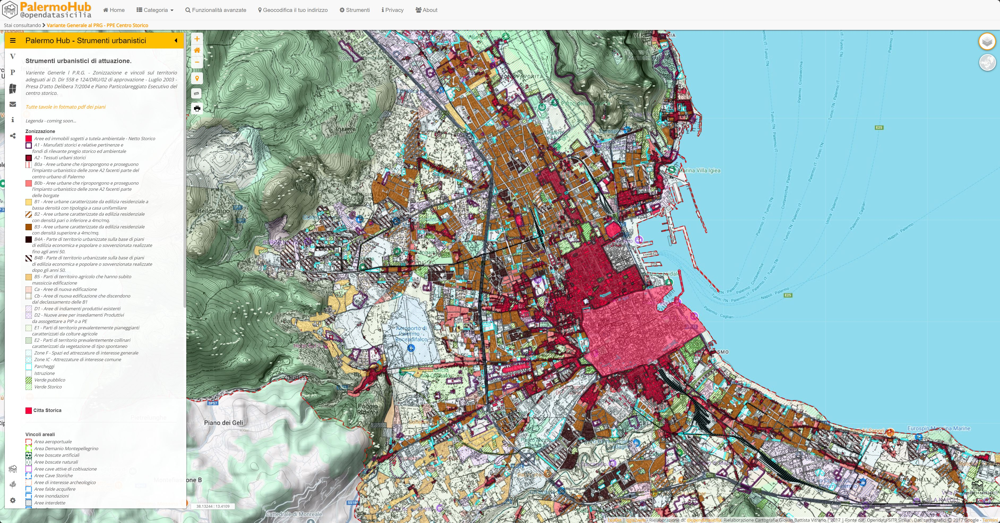

# PRG2004
Variente Generle l P.R.G. - Zonizzazione e vincoli sul territorio adeguati ai D. Dir 558 e 124/DRU/02 di approvazione - Luglio 2003 - Presa D'atto Delibera 7/2004 e Piano Particolareggiato Esecutivo del centro storico

[https://palermohub.opendatasicilia.it/index_prg.html](https://palermohub.opendatasicilia.it/index_prg.html "Variente Generle l P.R.G. - Zonizzazione e vincoli sul territorio adeguati ai D. Dir 558 e 124/DRU/02 di approvazione - Luglio 2003 - Presa D'atto Delibera 7/2004 e Piano Particolareggiato Esecutivo del centro storico"){target="_blank"}

## Tiles

ZTO:  https://palermohub.github.io/PRG2004/ZTO/{z}/{x}/{y}.png

Vincoli areali: https://palermohub.github.io/PRG2004/VA/{z}/{x}/{y}.png

Vincoli lineari: https://palermohub.github.io/PRG2004/VL/{z}/{x}/{y}.png
